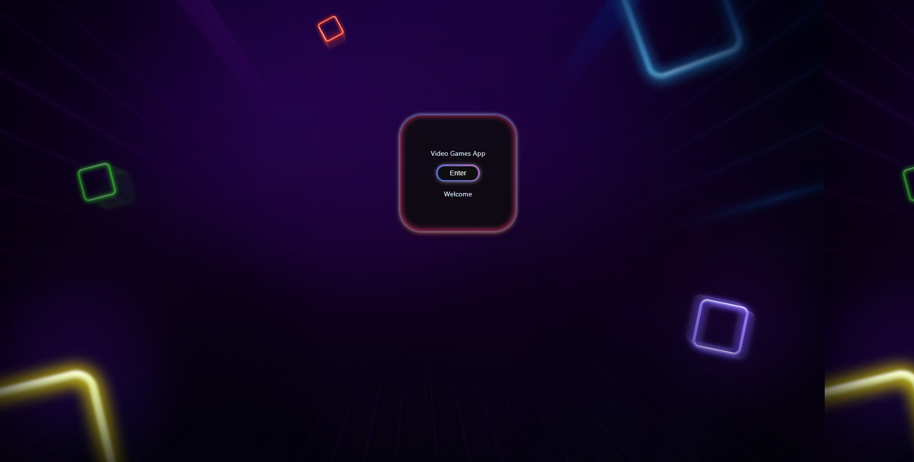
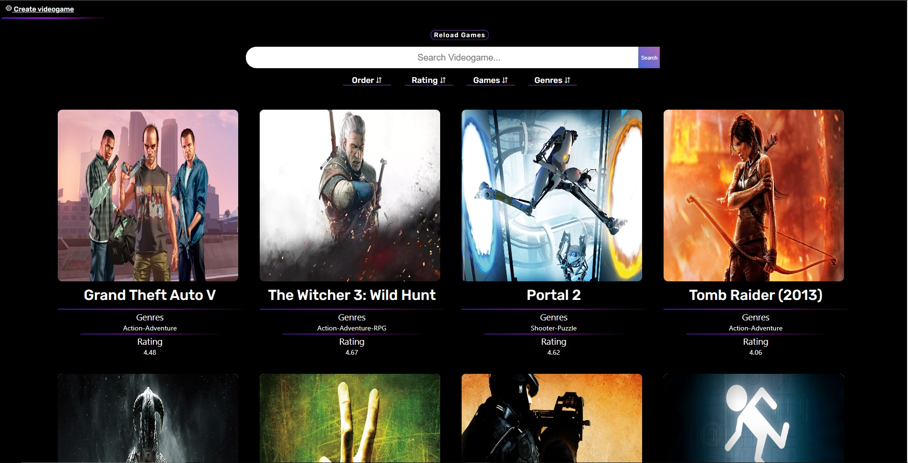
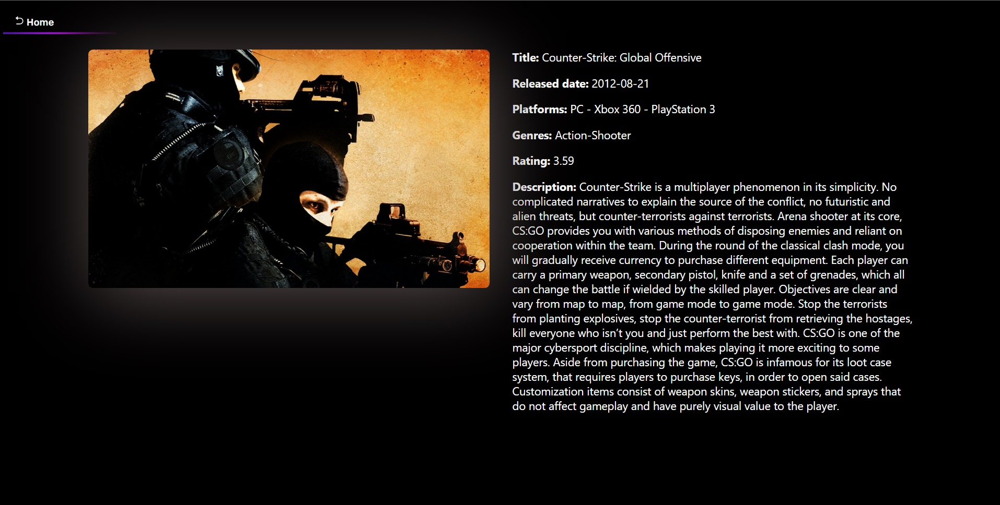

    

# Individual Project - Henry Videogames

## Video

<a>https://vimeo.com/manage/videos/642127095</a>

### Landing

  

### Home

  

### Detail

  

## Objetivos del Proyecto

- Construir una App utlizando React, Redux, Node y Sequelize.
- Afirmar y conectar los conceptos aprendidos en la carrera.
- Aprender mejores prácticas.
- Aprender y practicar el workflow de GIT.
- Usar y practicar testing.

## Enunciado

La idea general es crear una aplicación en la cual se puedan ver los distintos videojuegos disponibles junto con información relevante de los mismos utilizando la api externa [rawg](https://rawg.io/apidocs) y a partir de ella poder, entre otras cosas:

- Buscar videjuegos
- Filtrarlos / Ordenarlos
- Agregar nuevos videojuegos

#### Tecnologías necesarias:

- [ ] React
- [ ] Redux
- [ ] Express
- [ ] Sequelize - Postgres

#### Frontend

Se debe desarrollar una aplicación de React/Redux que contenga las siguientes pantallas/rutas.

**Pagina inicial**: deben armar una landing page con

- [ ] Alguna imagen de fondo representativa al proyecto
- [ ] Botón para ingresar al home (`Ruta principal`)

**Ruta principal**: debe contener

- [ ] Input de búsqueda para encontrar videojuegos por nombre
- [ ] Área donde se verá el listado de videojuegos. Deberá mostrar su:
  - Imagen
  - Nombre
  - Géneros
- [ ] Botones/Opciones para filtrar por género y por videojuego existente o agregado por nosotros
- [ ] Botones/Opciones para ordenar tanto ascendentemente como descendentemente los videojuegos por orden alfabético y por rating
- [ ] Paginado para ir buscando y mostrando los siguientes videojuegos, 15 juegos por pagina, mostrando los primeros 15 en la primer pagina.

**IMPORTANTE**: Dentro de la Ruta Principal se deben mostrar tanto los videjuegos traidos desde la API como así también los de la base de datos. Debido a que en la API existen alrededor de 500 mil juegos, por cuestiones de performance pueden tomar la simplificación de obtener y paginar los primeras 100.

**Ruta de detalle de videojuego**: debe contener

- [ ] Los campos mostrados en la ruta principal para cada videojuegos (imagen, nombre, y géneros)
- [ ] Descripción
- [ ] Fecha de lanzamiento
- [ ] Rating
- [ ] Plataformas

**Ruta de creación de videojuegos**: debe contener

- [ ] Un formulario **controlado** con los siguientes campos
  - Nombre
  - Descripción
  - Fecha de lanzamiento
  - Rating
- [ ] Posibilidad de seleccionar/agregar varios géneros
- [ ] Posibilidad de seleccionar/agregar varias plataformas
- [ ] Botón/Opción para crear un nuevo videojuego

#### Base de datos

El modelo de la base de datos deberá tener las siguientes entidades (Aquellas propiedades marcadas con asterísco deben ser obligatorias):

- [ ] Videojuego con las siguientes propiedades:
  - ID: \* No puede ser un ID de un videojuego ya existente en la API rawg
  - Nombre \*
  - Descripción \*
  - Fecha de lanzamiento
  - Rating
  - Plataformas \*
- [ ] Genero con las siguientes propiedades:
  - ID
  - Nombre

La relación entre ambas entidades debe ser de muchos a muchos ya que un videojuego puede pertenecer a varios géneros en simultaneo y, a su vez, un género puede contener múltiples videojuegos distintos. Un ejemplo sería el juego `Counter Strike` pertenece a los géneros Shooter y Action al mismo tiempo. Pero a su vez existen otros videojuegos considerados como Shooter o como Action.

**IMPORTANTE**: Pensar como modelar los IDs de los videojuegos en la base de datos. Existen distintas formas correctas de hacerlo pero tener en cuenta que cuando hagamos click en algun videojuego, este puede provenir de la API o de la Base de Datos por lo que cuando muestre su detalle no debería haber ambigüedad en cual se debería mostrar. Por ejemplo si en la API el videojuego `Age of Empires II: Age of Kings` tiene id = 1 y en nuestra base de datos creamos un nuevo videojuego `Age of Henry` con id = 1, ver la forma de diferenciarlos cuando querramos acceder al detalle del mismo.

#### Backend

Se debe desarrollar un servidor en Node/Express con las siguientes rutas:

**IMPORTANTE**: No está permitido utilizar los filtrados, ordenamientos y paginados brindados por la API externa, todas estas funcionalidades tienen que implementarlas ustedes.

- [ ] **GET /videogames**:
  - Obtener un listado de los videojuegos
  - Debe devolver solo los datos necesarios para la ruta principal
- [ ] **GET /videogames?name="..."**:
  - Obtener un listado de las primeros 15 videojuegos que contengan la palabra ingresada como query parameter
  - Si no existe ningún videojuego mostrar un mensaje adecuado
- [ ] **GET /videogame/{idVideogame}**:
  - Obtener el detalle de un videojuego en particular
  - Debe traer solo los datos pedidos en la ruta de detalle de videojuego
  - Incluir los géneros asociados
- [ ] **GET /genres**:
  - Obtener todos los tipos de géneros de videojuegos posibles
  - En una primera instancia deberán traerlos desde rawg y guardarlos en su propia base de datos y luego ya utilizarlos desde allí
- [ ] **POST /videogame**:
  - Recibe los datos recolectados desde el formulario controlado de la ruta de creación de videojuego por body
  - Crea un videojuego en la base de datos

#### Testing

- [ ] Al menos tener un componente del frontend con sus tests respectivos
- [ ] Al menos tener una ruta del backend con sus tests respectivos
- [ ] Al menos tener un modelo de la base de datos con sus tests respectivos
